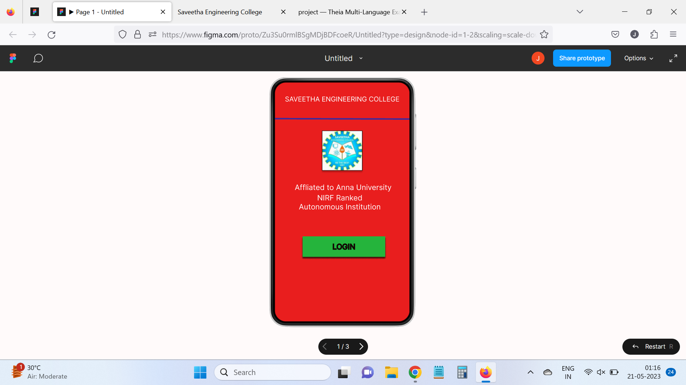
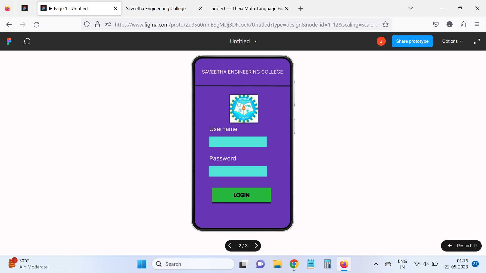
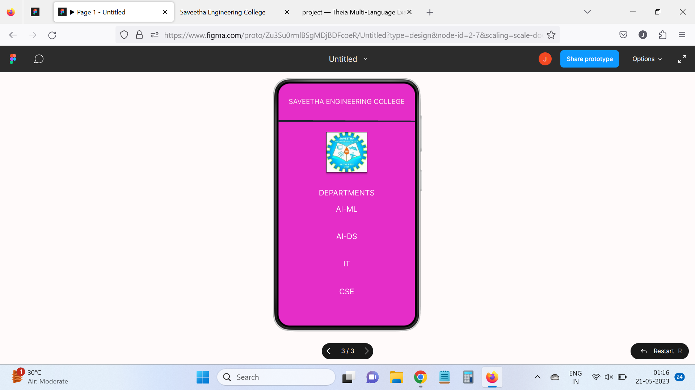

# Event Registration Web Application

## AIM:
To design, develop and deploy a web application for event registration.

## DESIGN STEPS:

### Step 1:
Create a new frame.

### Step 2:
Select any one preset of your choice.

### Step 3:
Select the shapes you need.

### Step 4:
Import images as needed.

### Step 5:
Create pages based on your need and link them.
### Step 6:

Validate the HTML and CSS code.

### Step 6:
Validate the HTML and CSS code.

### Step 7:
Publish the website in the given URL.

### DESIGN TOOL:
Figma

### Program:
```
/* Home Page */

position: relative;
width: 360px;
height: 640px;
background: #E91E1E;


/* Login Page */

position: relative;
width: 360px;
height: 640px;
background: #6535B4;


/* SAVEETHA ENGINEERING COLLEGE */

position: absolute;
width: 310px;
height: 48px;
left: 25px;
top: 36px;
font-family: 'Inter';
font-style: normal;
font-weight: 400;
font-size: 18px;
line-height: 22px;
text-align: center;
color: #FCEDF0;


/* Line 3 */

position: absolute;
width: 360px;
height: 0px;
left: 0px;
top: 101px;
border: 4px solid #242034;
transform: rotate(0.16deg);


/* logonew 3 */

box-sizing: border-box;
position: absolute;
width: 108px;
height: 107px;
left: calc(50% - 108px/2);
top: calc(50% - 107px/2 - 138.5px);
background: url(logonew.jpg);
border: 1px solid #000000;
filter: drop-shadow(0px 4px 4px rgba(0, 0, 0, 0.25));


/* DEPARTMENTS */

position: absolute;
width: 162px;
height: 43px;
left: 99px;
top: 277px;
font-family: 'Inter';
font-style: normal;
font-weight: 400;
font-size: 20px;
line-height: 24px;
text-align: center;
color: #FFFFFF;


/* AI-ML */

position: absolute;
width: 80px;
height: 30px;
left: 140px;
top: 320px;
font-family: 'Inter';
font-style: normal;
font-weight: 400;
font-size: 20px;
line-height: 24px;
text-align: center;
color: #FFFFFF;


/* CSE */

position: absolute;
width: 80px;
height: 30px;
left: 140px;
top: 538px;
font-family: 'Inter';
font-style: normal;
font-weight: 400;
font-size: 20px;
line-height: 24px;
text-align: center;
color: #FFFFFF;


/* IT */

position: absolute;
width: 80px;
height: 30px;
left: 140px;
top: 464px;
font-family: 'Inter';
font-style: normal;
font-weight: 400;
font-size: 20px;
line-height: 24px;
text-align: center;
color: #FFFFFF;


/* AI-DS */

position: absolute;
width: 80px;
height: 30px;
left: 140px;
top: 392px;
font-family: 'Inter';
font-style: normal;
font-weight: 400;
font-size: 20px;
line-height: 24px;
text-align: center;
color: #FFFFFF;
```

## OUTPUT:




## Result:
The program to design, develop and deploy a web application for event registration is completed successfully.
